# SOC Analyst Home Lab
Enterprise Security Operations Center (SOC) Environment

This project documents the enterprise-style Security Operations Center (SOC) lab that serves as the foundation for every repository in my cybersecurity portfolio.

## Tools Used
- Wireshark
- Ubuntu Linux Virtual Machine
- Oracle VirtualBox
- Linux networking utilities (`ping`, `curl`, `nslookup`)

- Lab Environment
A controlled virtual lab environment was configured using Ubuntu Linux running inside Oracle VirtualBox. Network traffic was intentionally generated and captured for analysis using Wireshark.

## Traffic generated included:
- ICMP ping requests
- DNS lookups
- HTTPS web traffic
- TCP connections

## Traffic Analysis
  -ICMP Analysis
 ICMP Echo Requests and Echo Replies were analyzed to observe connectivity testing behavior between the internal virtual machine and external hosts.
## Observations
- Successful ICMP request/reply communication observed
- Consistent TTL values identified
- No signs of packet flooding or suspicious scanning behavior
## Security Assessment
 The observed ICMP traffic appeared to be legitimate diagnostic traffic commonly associated with standard network connectivity testing.

## Key Learnings
- Learned how to capture and inspect network packets using Wireshark
- Analyzed ICMP request and reply behavior
- Observed normal network communication patterns
- Practiced SOC-style traffic investigation and documentation
- Improved understanding of packet-level analysis workflows

##  HTTPS / TLS Traffic Analysis
Encrypted HTTPS traffic was analyzed to observe secure client-server communication and TLS session establishment behavior.
### Observations
- Multiple outbound TCP connections observed over port 443
- TLSv1.2 encrypted sessions identified
- TLS handshake activity captured, including:
  - Client Key Exchange
  - Change Cipher Spec
  - Encrypted Handshake Messages
- Encrypted application data successfully transmitted between client and remote host

### Security Assessment
The observed traffic appeared consistent with legitimate encrypted HTTPS browsing activity. No suspicious or anomalous encrypted traffic patterns were identified during analysis.

## TCP Handshake Analysis
TCP connection establishment behavior was analyzed using Wireshark to observe the standard TCP three-way handshake process and session termination activity.

### Observations
- TCP SYN/ACK packets observed during HTTPS session establishment
- ACK packets confirmed successful client-server communication
- FIN/ACK packets identified during graceful TCP session termination
- Multiple outbound TCP connections established over port 443

  ### Security Assessment
Observed TCP behavior appeared consistent with legitimate encrypted web traffic and standard client-server communication patterns. No suspicious or malformed TCP activity was identified during analysis.

## 📷 TCP Packet Capture

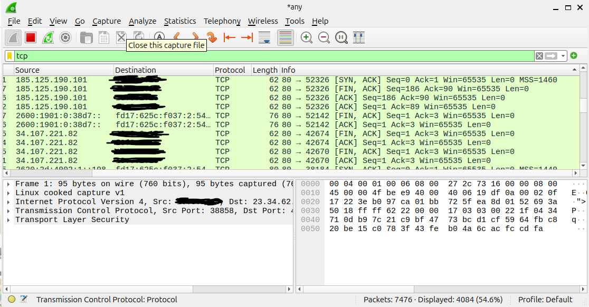


##  DNS Traffic Analysis
DNS traffic was analyzed to observe hostname resolution behavior and DNS query activity generated within the Ubuntu virtual machine environment.

### Observations
- Standard DNS queries and responses successfully captured
- Both A (IPv4) and AAAA (IPv6) record lookups were identified
- DNS communication observed between the local resolver and the external DNS server
- Successful domain resolution confirmed for reddit.com

### Security Assessment
Observed DNS activity appeared consistent with legitimate user-generated browsing traffic and standard hostname resolution behavior. No suspicious or malicious domain requests were identified during analysis.

## 📷 DNS Packet Capture

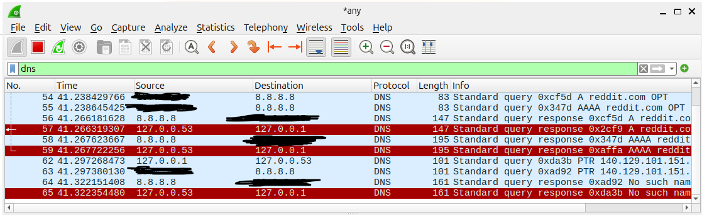


## Splunk Security Event Monitoring Lab

Windows Security Event Logs were ingested into Splunk Enterprise to simulate SOC-style monitoring and authentication event analysis workflows.

### Log Sources
- Windows Security Event Logs
- Windows System Logs
- Windows Application Logs

### Splunk Searches Performed

#### Failed Login Detection
```spl
source="WinEventLog:Security" EventCode=4625
```
Observed failed Windows authentication attempts generated intentionally during lab testing.

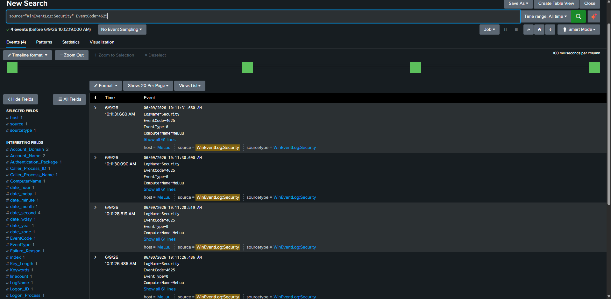

Observed successful Windows authentication events.

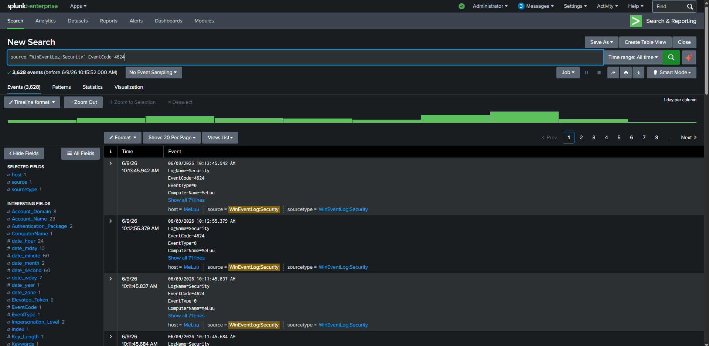

#### Process Creation Monitoring
```spl
source="WinEventLog:Security" EventCode=4688
```

Used to identify process execution activity within the Windows environment.

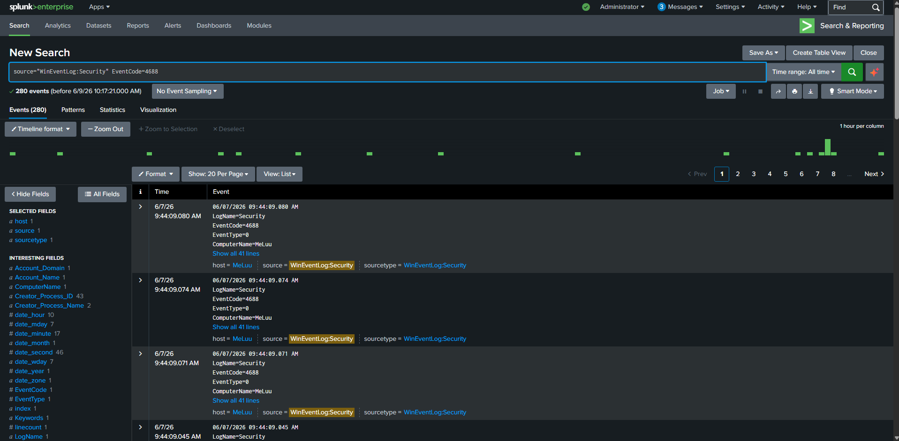

### Security Assessment

Splunk successfully ingested and indexed Windows event logs, allowing detection and investigation of authentication-related security events. Simulated failed login activity was successfully identified using Splunk search queries.


# Sysmon Endpoint Monitoring

## Project Objective

Deploy Sysmon on a Windows host and integrate Sysmon telemetry into Splunk Enterprise for endpoint visibility and security monitoring.

## Tools Used

- Sysmon
- Splunk Enterprise
- Splunk Universal Forwarder
- Windows Event Viewer

## Deployment

### Sysmon Installation

Sysmon was installed using a custom XML configuration file.

### Log Verification

Verified Sysmon Event ID 1 (Process Creation) events in:

```text
Applications and Services Logs
└── Microsoft
    └── Windows
        └── Sysmon
            └── Operational
```

### Splunk Forwarding

Configured Splunk Universal Forwarder to collect:

```text
Microsoft-Windows-Sysmon/Operational
```

and forward events to Splunk Enterprise.

## Troubleshooting

Sysmon events initially failed to appear in Splunk.

### Error Observed

```text
Could not subscribe to Windows Event Log channel
Microsoft-Windows-Sysmon/Operational

errorCode=5
```

### Root Cause

The Universal Forwarder service account lacked permission to subscribe to the Sysmon event channel.

### Resolution

Changed the Splunk Universal Forwarder service account to:

```text
Local System
```

After restarting the service, Sysmon events were successfully ingested into Splunk.

## Validation

Splunk search used:

```spl
source="WinEventLog:Microsoft-Windows-Sysmon/Operational"
```

Results:

- Sysmon events successfully indexed
- Process Creation telemetry collected
- Endpoint activity visible in Splunk

## Skills Demonstrated

- Endpoint Monitoring
- Sysmon Deployment
- Splunk Administration
- Windows Event Log Analysis
- Log Ingestion Troubleshooting
- SIEM Operations

## Screenshots

### Sysmon Event Viewer - Process Creation Events

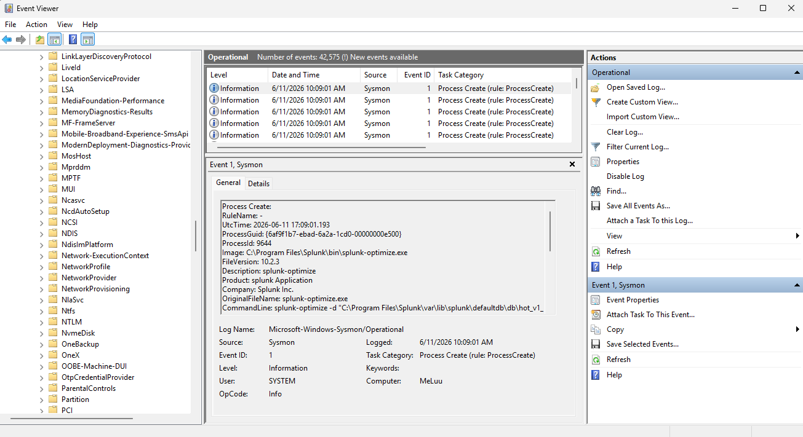

### Sysmon Events Successfully Indexed in Splunk

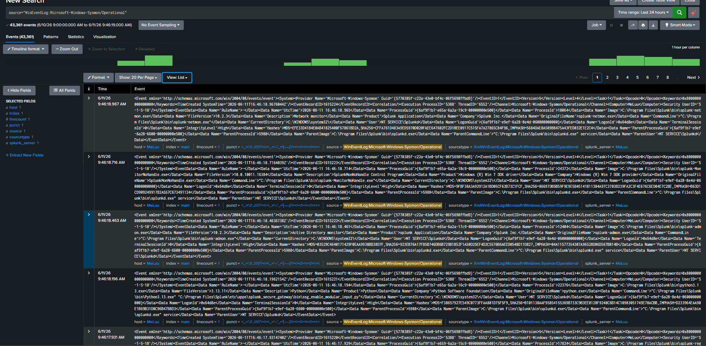

### Troubleshooting Sysmon Collection

The Universal Forwarder initially failed to subscribe to the Sysmon Operational event channel due to insufficient permissions.

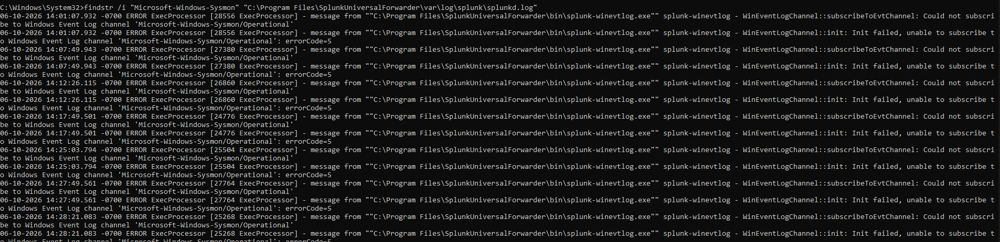

### Successful Resolution

After reconfiguring the Splunk Universal Forwarder service to run as Local System, Sysmon events were successfully ingested into Splunk.

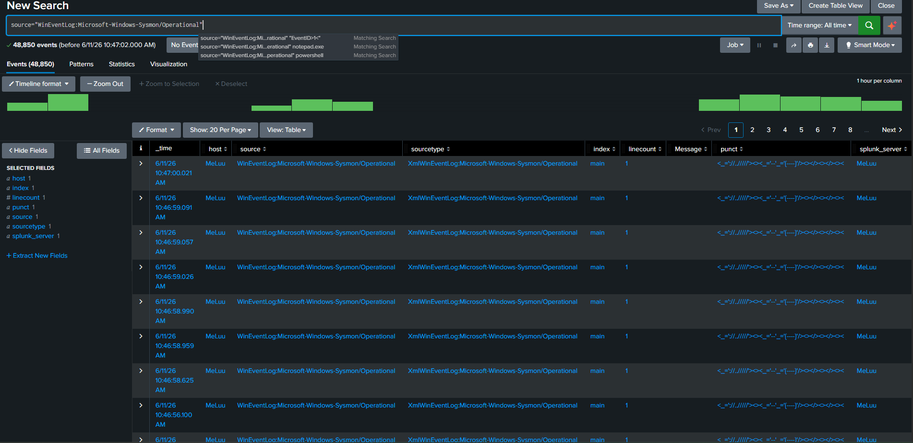


## Brute Force Detection Lab

## Objective

The objective of this lab was to detect and investigate failed Windows authentication attempts using Splunk Enterprise.

Windows Security Event Logs were collected and analyzed to identify Event ID 4625 failed logon events. This lab demonstrates how a SOC analyst can monitor authentication activity, investigate login failures, and identify indicators of brute force attack activity.

---

## Tools Used

- Splunk Enterprise
- Windows Event Viewer
- Windows Security Logs
- Windows Command Prompt
- Windows Authentication Events

---

## Log Sources

### Windows Security Log

The following security events were analyzed:

- Event ID 4625 - Failed Logon
- Event ID 4624 - Successful Logon

---

## Detection Query

### Failed Login Detection

```spl
source="WinEventLog:Security"
EventCode=4625
```

This search returns failed Windows authentication attempts collected from the Security Event Log.

---

## Investigation Process

Multiple failed login attempts were generated within the lab environment and successfully indexed into Splunk.

The investigation focused on Event ID 4625 events, which provide valuable authentication details including:

- Account Name
- Account Domain
- Source Network Address
- Authentication Package
- Logon Process
- Failure Reason

These fields allow analysts to determine who attempted the login, where it originated from, and why the authentication failed.

---

## Validation

The following search confirmed successful ingestion of failed login events:

```spl
source="WinEventLog:Security"
EventCode=4625
```

Results confirmed:

- Failed authentication attempts were successfully indexed
- Security events were searchable within Splunk
- Authentication failures could be investigated through event metadata

---

## Security Assessment

Splunk successfully detected failed Windows authentication attempts through Event ID 4625 monitoring.

The generated events simulated failed login activity that security teams commonly investigate when looking for:

- Brute Force Attacks
- Password Spraying
- Unauthorized Access Attempts
- Account Enumeration Activity

---

## Screenshots

### Failed Login Detection

Shows Event ID 4625 events successfully indexed into Splunk.

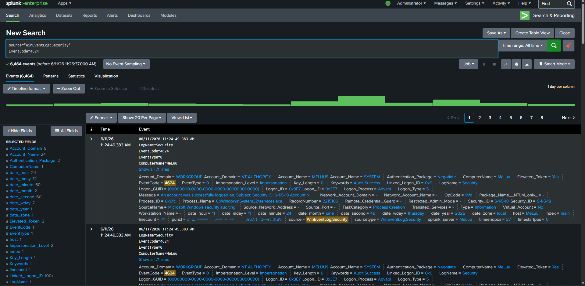

### Event Details Investigation

Expanded Event ID 4625 event showing authentication details and failure information.

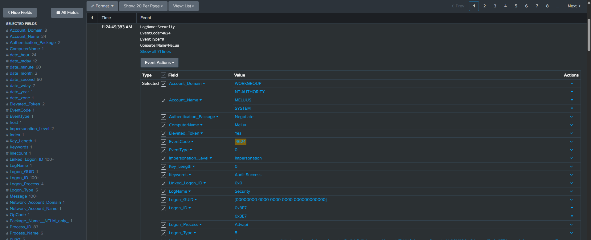

### Security Event Analysis

Review of failed authentication activity within Splunk Enterprise.

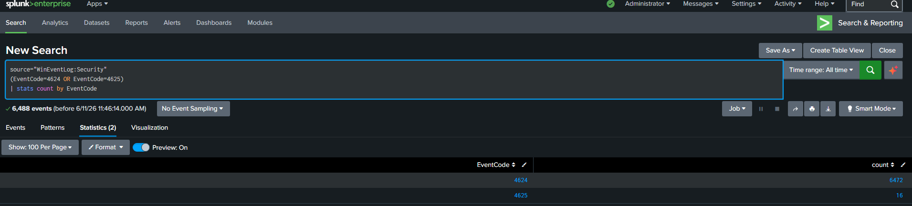

---

## Key Learnings

- Windows Security Event Monitoring
- Authentication Log Analysis
- Event ID 4625 Investigation
- Splunk Search Techniques
- Security Event Correlation
- Brute Force Detection Fundamentals
- SOC Investigation Workflow

# Windows Incident Investigation Lab

## Objective

Investigate endpoint activity using Sysmon telemetry and Splunk Enterprise.

## Scenario

A user reported unusual activity on their workstation.

The investigation focused on identifying executed processes, network activity, and DNS queries using Sysmon telemetry.

## Investigation Steps

### Process Activity

Reviewed Sysmon Process Creation events.

### Network Activity

Reviewed Sysmon Network Connection events.

### DNS Activity

Reviewed Sysmon DNS Query events.

## Findings

The following activity was observed:

- Command Prompt execution
- PowerShell execution
- DNS lookups
- Network connections
- User activity

## Conclusion

The observed activity was determined to be normal user-generated behavior during testing.

No indicators of compromise were identified.

## Screenshots

### Process activity

Sysmon Process Creation (Event ID 1) events were analyzed to identify user-executed processes. Command Prompt activity was successfully detected and investigated within Splunk Enterprise.

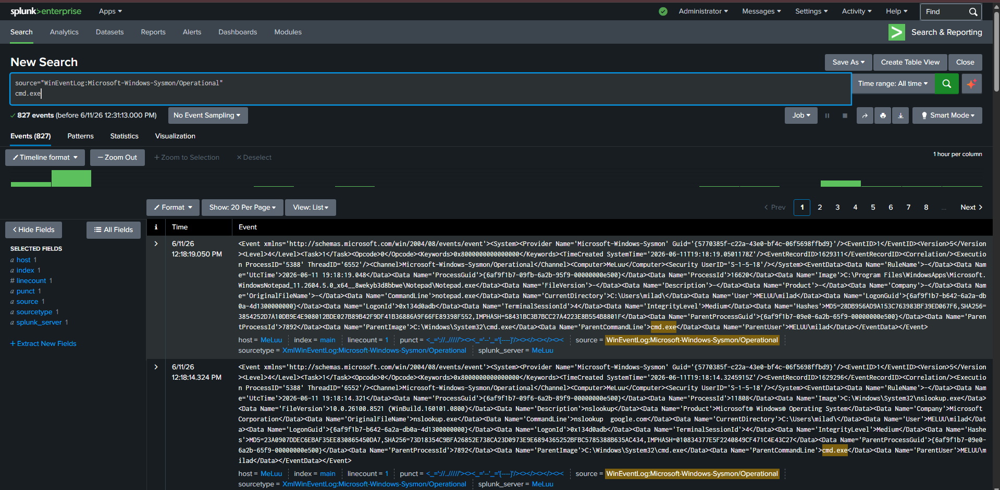

### DNS query

Sysmon DNS Query events were reviewed to identify domain resolution activity. The investigation confirmed successful detection of DNS requests generated through nslookup.

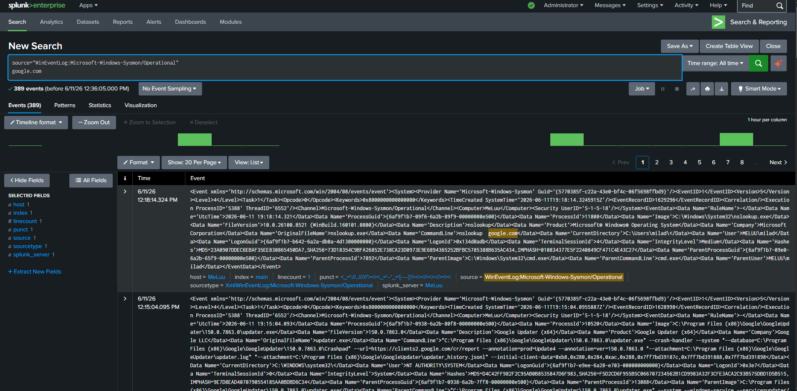

### Network activity

Sysmon Network Connection (Event ID 3) events were analyzed to identify outbound network communications. The investigation captured destination IP addresses, ports, protocols, and associated processes.

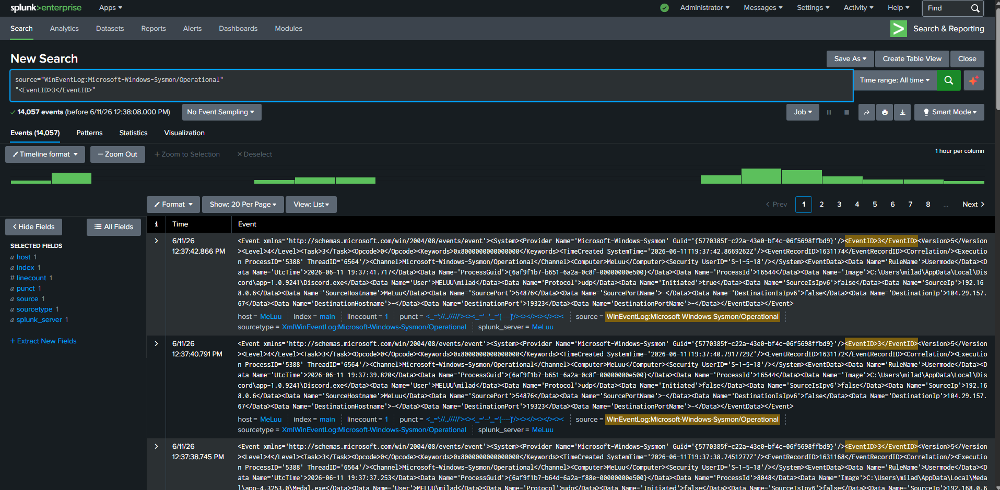


## Security Notes
 Sensitive internal network information and identifiers were sanitized before publication.


